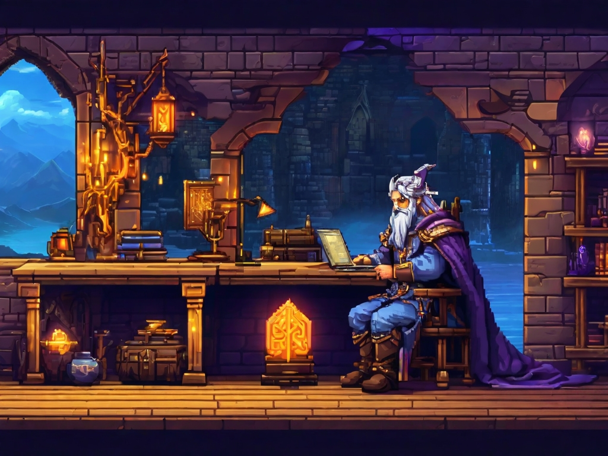

<!-- Banner principal (recomendado: 1200x300 px) -->

  <!-- Reemplaza 'banner.png' por tu imagen personalizada -->
  

<h1 align="center">¡Hola, soy Víctor Manuel Ángeles Muthe! </h1>

  <b>Ingeniero en Gestión y Desarrollo de Software · Full-Stack Developer Junior</b>

  
  
  

---

## 📋 Índice
- [Perfil](#perfil)
- [Educación](#educación)
- [Habilidades Técnicas](#habilidades-técnicas)
- [Certificaciones](#certificaciones)
- [Proyectos Destacados](#proyectos-destacados)
- [Hobbies](#hobbies)
- [Contacto](#contacto)

---

## 🌟 Perfil

> Soy un ingeniero en Gestión y Desarrollo de Software apasionado por crear soluciones tecnológicas que simplifican procesos y generan impacto. Especializado en desarrollo web full-stack con Laravel, mi enfoque está en optimizar flujos de trabajo y mejorar la experiencia del usuario.  
> 
> - 🚀 Aumenté la eficiencia operativa en un 30% al reducir 20 horas de trabajo manual mensual.  
> - 🔒 Fortalecí la seguridad de datos en un 15% mediante autenticaciones robustas.  
> - ⚡ Aceleré procesos de selección en un 20% con plataformas optimizadas.  
> 
> Actualmente, exploro tecnologías emergentes como IA y Machine Learning para innovar en mis soluciones.

---

## 🎓 Educación

| Grado | Institución | Año |
|-------|-------------|-----|
| Ingeniería en Desarrollo y Gestión de Software | Universidad Tecnológica del Valle del Mezquital | Abril 2025 |
| TSU en Tecnologías de la Información (Desarrollo Multiplataforma) | Universidad Tecnológica del Valle del Mezquital | Agosto 2023 |

---

## 🛠️ Habilidades Técnicas

### Lenguajes

### Front-end

### Back-end

### Bases de datos

### Herramientas

### Metodologías

---

## 📜 Certificaciones

- Database Programming with SQL – Oracle Academy (2022)
- Java Fundamentals – Oracle Academy (2022)
- NDG Linux Essentials – Cisco Networking Academy (2022)
- Applied Database Systems (2024)

---

## 🚀 Proyectos Destacados

| Proyecto | Descripción | Enlace |
|----------|-------------|--------|
| **Agenda en Laravel** | Aplicación de agenda personal con autenticación segura (Laravel 12, MySQL). Resolví problemas de concurrencia optimizando consultas en un 20%. | [Ver repositorio](https://github.com/VictorM4nu31/Agenda) |
| **E-commerce en Laravel (Sport Plus)** | Tienda online de artículos deportivos (Laravel 11, MySQL, Tailwind CSS). Implementé un sistema de pagos seguro, mejorando la experiencia de usuario en un 15%. | [Ver repositorio](https://github.com/VictorM4nu31/System_Sport_plus) |

---

## 🎮 Hobbies

- 🎮 Jugar videojuegos: Explorando mundos virtuales y dinámicas de juego.
- 🇯🇵 Cultura japonesa: Aficionado al anime, manga y tradiciones culturales.
- 🎬 Ver películas y series: Fan de historias épicas y narrativas profundas.
- 📚 Leer novelas: Ciencia ficción y fantasía.

---

## 🤝 Contacto

  
  
  
  

---

  ⭐️ Si te gusta mi trabajo, no olvides darle ⭐️ a mis repositorios.   
  🌐 Visita mi portafolio: <b>victor-manuel.dev</b> (en construcción).

